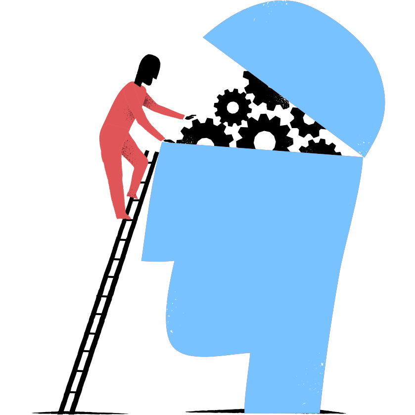



Wiki, meet notebook

<h1 class="header-title">Your open source external brain</h1>

<b>tiddlyroam</b> is a notetaking app that let's you focus on your ideas. It'll join them up for you.

<a class="nav-link learn-more-btn" href="#about">Learn More</a>



<h2>{{ benefit.title }}</h2>

{{ benefit.description }}



What tiddlyroam does

<h2 class="contact-title">Quickly create your own personal wiki</h2>

Add fragments of thoughts and findings whenever they come to you. TiddlyRoam will link them and help you spot the patterns.

<a class="nav-link learn-more-btn btn-invert" href="#quickstart">Get started</a>

What makes tiddlyroam tick

<h2 class="contact-title">Bi-directional links</h2>

Bi-directional links allow you to see not just all the pages that a page links to, but also all pages that link to <i>it</i>.

<h2 class="contact-title">+ Graph maps</h2>

Graph maps visualise all the pages you have made and how they link together.

<h2 class="contact-title">= Networked thought</h2>

The combination leads to what Roam calls ‘networked thought’. This is best explained by a tiddlyroam user:

<h3 class="quote">"it's like having a second brain."</h3>

Zero to tiddlyroam hero

<h2 class="services-title">Quickstart</h2>

<ol>
<li>Download <a href = "https://github.com/joekroese/tiddlyroam/releases/download/v1.0/tiddlyroam.html">tiddlyroam.html</a></li>
<li>Download <a href = "https://github.com/Jermolene/TiddlyDesktop/releases">TiddlyDesktop</a></li>
<li>Open tiddlyroam.html in TiddlyDesktop</li>
</ol>

<b>Yes, it is that easy.</b>

<a class="nav-link learn-more-btn" href="#tutorials">Next steps</a>

<!-- 

All sorts of good folk use <b>tiddlyroam</b>

<h2 class="clients-title">User Showcase</h2>





 -->

Level up your external brain

<h2 class="blog-title">Featured tutorials</h2>

<h3 class="blog-post-title">For TiddlyWiki users</h3>

Transitioning to tiddlyroam with the plugin

<a class="blog-post-link" href="#tiddlywiki-to-tiddlyroam">Read More</a>

<h3 class="blog-post-title">Quickstart</h3>
<h4 class="blog-post-subtitle">Write notes in tiddlyroam in less than two minutes.</h4>
<!-- 
The tiddlyroam approach is built on simplicity.
 -->
<a class="nav-link learn-more-btn" href="#quickstart">Read More</a>

<h3 class="blog-post-title">Extending tiddlyroam</h3>

Got the basics? Set up tiddlyroam on mobile.

<a class="blog-post-link" href="#extending-tiddlyroam">Read More</a>

Community

<h2 class="contact-title">tiddlyroam: built by people like you and me.</h2>

<b>tiddlyroam</b> is an open source project. Our community supports new users, request new features and fix any cracks.

<a class="nav-link learn-more-btn" href="https://github.com/joekroese/tiddlyroam">Meet the community</a>



